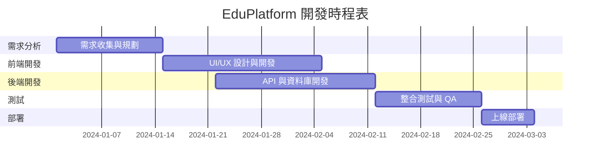
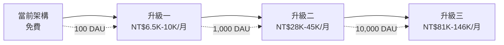
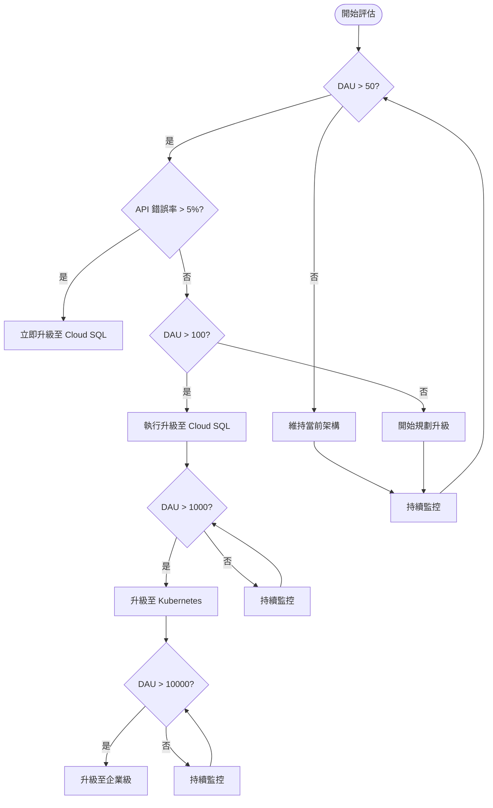

# EduPlatform 開發文件摘要

> 本文件為 [完整開發文件](DEVELOPMENT_DOCUMENTATION.md) 的視覺化摘要

---

## 📊 開發時程總覽



**總開發時程**: 7-12 週 (約 2-3 個月)

---

## 💰 開發成本比較

### 人力成本方案比較

| 方案 | 團隊規模 | 總工時 | 成本範圍 (TWD) | 適用情境 |
|------|---------|--------|---------------|---------|
| **方案一：小型團隊** | 2 人 | 400 小時 | **304,000 - 464,000** | 新創公司、MVP |
| **方案二：標準團隊** | 5 人 | 600 小時 | **464,000 - 704,000** | 中小企業 |
| **方案三：完整團隊** | 7 人 | 920 小時 | **772,000 - 1,200,000** | 大型企業 |

---

## 🚀 基礎設施成本階梯



### 月運營成本對照表

| 架構方案 | 用戶規模 | 月費用 (TWD) | 同時在線 | 可用性 |
|---------|---------|-------------|---------|--------|
| **當前 (免費)** | < 100 DAU | **0-500** | 10-15 人 | 95% |
| **Cloud SQL** | 100-1K DAU | **6,500-10,000** | 100-500 人 | 99.5% |
| **Kubernetes** | 1K-10K DAU | **28,000-45,000** | 1K-5K 人 | 99.9% |
| **企業級** | 10K+ DAU | **81,000-146,000** | 10K+ 人 | 99.99% |

---

## ⚠️ 當前架構限制

### Google Apps Script 限制

| 項目 | 限制值 | 實際影響 |
|------|--------|---------|
| 每日 API 呼叫 | 20,000 次/天 | 約 833 次/小時 |
| 單次執行時間 | 6 分鐘 | 長查詢會逾時 |
| 同時執行數 | 30 個 | 高並發會排隊 |

### Google Sheets 限制

| 項目 | 限制值 | 實際影響 |
|------|--------|---------|
| 最大儲存格數 | 500 萬個 | 約 50,000 筆用戶 |
| 單次讀取速度 | 1-3 秒 | 查詢效能受限 |
| 同時編輯數 | 100 人 | 高並發寫入失敗 |

### 同時在線用戶上限計算

```
輕度使用 (每分鐘 2 次 API):
  每小時呼叫 = 用戶數 × 2 × 60
  833 / 120 = 約 6-7 人

中度使用 (每分鐘 1 次 API):
  每小時呼叫 = 用戶數 × 1 × 60
  833 / 60 = 約 13-14 人

建議上限: 10-15 人同時在線
```

---

## 🎯 升級決策流程圖



---

## 💡 升級投資回收期 (ROI)

假設條件：
- 付費用戶比例：10%
- 月費：NT$ 299/人

### 方案一：Cloud SQL 升級

```
投資成本: NT$ 290,000 (一次性)
月運營成本: NT$ 10,000

用戶規模: 5,000 人
月收入: 5,000 × 10% × 299 = NT$ 149,500
月淨利: 149,500 - 10,000 = NT$ 139,500

投資回收期: 290,000 / 139,500 = 2.1 個月 ✅
```

### 方案二：Kubernetes 升級

```
投資成本: NT$ 950,000 (一次性)
月運營成本: NT$ 45,000

用戶規模: 20,000 人
月收入: 20,000 × 10% × 299 = NT$ 598,000
月淨利: 598,000 - 45,000 = NT$ 553,000

投資回收期: 950,000 / 553,000 = 1.7 個月 ✅
```

---

## 📋 升級檢查清單

### 立即升級條件 (任一符合即需升級)

- [ ] API 回應時間 > 3 秒
- [ ] 資料庫查詢時間 > 2 秒
- [ ] 頁面載入時間 > 5 秒
- [ ] Sheets 儲存格使用率 > 80%
- [ ] 每日 API 呼叫 > 16,000 次
- [ ] 註冊用戶數 > 5,000 人
- [ ] 每日錯誤率 > 5%
- [ ] 系統可用性 < 95%

### 升級準備清單

#### 技術準備
- [ ] 完成資料備份
- [ ] 準備遷移腳本
- [ ] 設定測試環境
- [ ] 準備回滾計畫

#### 預算準備
- [ ] 確認一次性預算 (NT$ 160K-290K)
- [ ] 確認月運營預算 (NT$ 6.5K-10K)
- [ ] 預留 20% 緊急預算

#### 人力準備
- [ ] 指派專案負責人
- [ ] 安排 DevOps 工程師
- [ ] 安排測試人員
- [ ] 準備用戶溝通計畫

---

## 📞 快速參考

### 關鍵數據速查

| 指標 | 當前值 | 升級觸發點 |
|------|--------|-----------|
| 同時在線用戶 | 10-15 人 | > 10 人 |
| 每日活躍用戶 (DAU) | 100-200 人 | > 80 人 |
| 總註冊用戶 | 1K-5K 人 | > 5K 人 |
| API 回應時間 | 1-3 秒 | > 3 秒 |
| 系統可用性 | ~95% | < 95% |

### 預算速查

| 項目 | 金額 (TWD) |
|------|-----------|
| 最低開發成本 | 304,000 |
| 建議開發成本 | 464,000 - 704,000 |
| 第一次升級 (一次性) | 160,000 - 290,000 |
| 第一次升級 (月費) | 6,500 - 10,000 |
| 第二次升級 (一次性) | 480,000 - 950,000 |
| 第二次升級 (月費) | 28,000 - 45,000 |

---

## 🔗 相關文件

- [完整開發文件](DEVELOPMENT_DOCUMENTATION.md) - 詳細的開發流程、成本分析與升級方案
- [README.md](README.md) - 專案說明與使用指南

---

**文件版本**: 1.0  
**最後更新**: 2025-11-25
